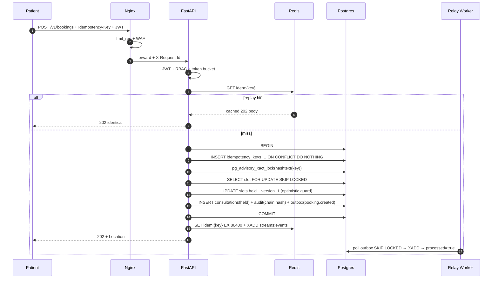
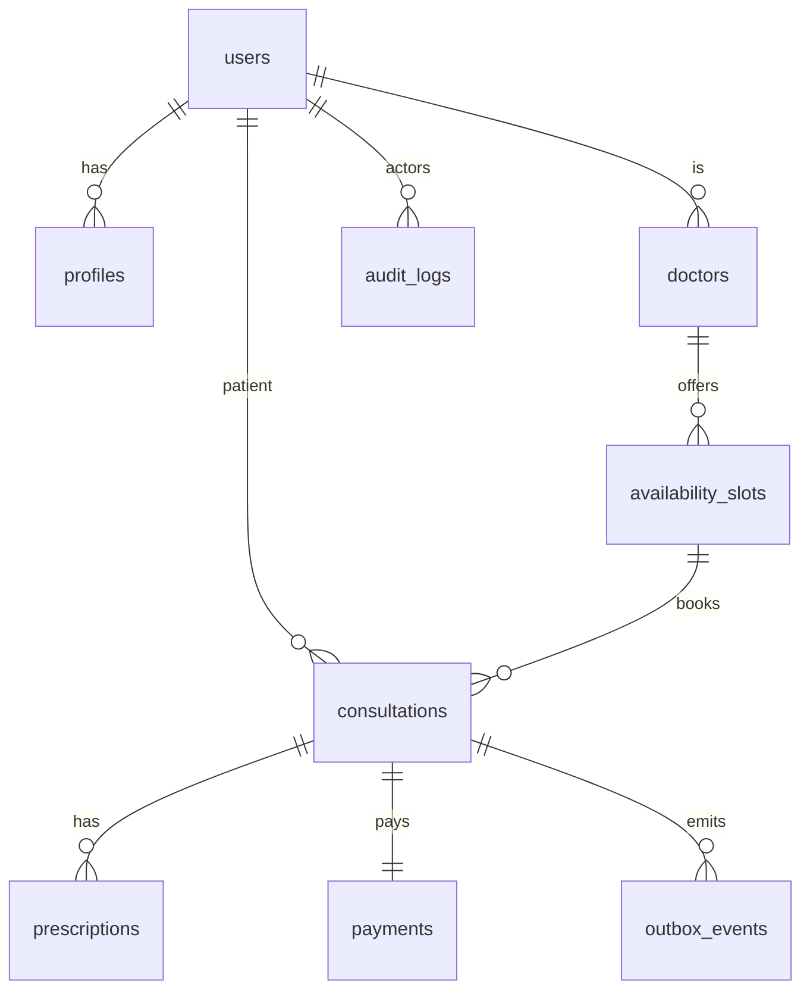

Amrutam's backend is built around a single architectural principle: **stateless API replicas backed by a stateful, carefully partitioned Postgres primary**. FastAPI processes hold no in-memory state between requests — session data, idempotency records, and cached results all live in Redis or Postgres. This means any replica can serve any request, Nginx can evict unhealthy replicas without coordination, and scaling out requires nothing more than `docker compose up --scale api=N`. The sections below document every layer of that architecture, from edge to storage to observability.

## Service Topology

The full stack is defined in `docker-compose.yml`. The table below maps each service to its role, image, and network exposure:

| Service | Image / Source | Host Ports | Role |
|---|---|---|---|
| `nginx` | `nginx:1.27-alpine` | `8080→80`, `8443→443` | TLS termination, edge rate limiting (`20 r/s IP`, `10 r/s JWT`), health-evicting LB (`max_fails=3`) |
| `api` ×N | `Dockerfile` → `src/amrutam` | in-network `:8000` only | Stateless FastAPI replicas (Uvicorn); share an RS256 keypair via `jwt-secrets` volume |
| `worker` | same image, `python -m amrutam.workers.relay` | — | Outbox relay: polls `outbox_events`, publishes to Redis Streams, settles payment saga (`--profile worker`) |
| `scheduler` | same image, `python -m amrutam.workers.scheduler` | — | Materialized-view refresh cron (`--profile worker`) |
| `postgres-primary` | `postgres:16-alpine` | `:5432` | RW source of truth; partitioned tables; WAL → MinIO for backup |
| `postgres-replica` | `postgres:16-alpine` | `:5434` | RO search and analytics (`--profile replica`); lag alert >10 s |
| `redis` | `redis:7-alpine` | `:6379` | Idempotency replay cache (TTL 24 h), token-bucket rate limits, Redis Streams event bus, refresh JTI store |
| `minio` | `quay.io/minio/minio:latest` | `:9000`, `:9001` | S3-compatible store for Rx PDFs and WAL backups |
| `otel-collector` | `otel/opentelemetry-collector-contrib:0.102.0` | `:4317`, `:4318` | Receives OTLP spans/metrics, fans out to Prometheus, Loki, Tempo |
| `prometheus` | `prom/prometheus:v2.52.0` | `:9090` | Scrapes `/metrics` per replica + exporters; evaluates SLO alert rules |
| `loki` | `grafana/loki:2.9.6` | `:3100` | Structured JSON log ingestion (structlog → stdout → Loki) |
| `tempo` | `grafana/tempo:2.4.1` | `:3200` | Distributed trace backend |
| `grafana` | `grafana/grafana:10.4.2` | `:3000` | Dashboards: API RED, per-replica RED, Postgres, Redis, Business, SLO burn |
| `postgres-exporter` | `quay.io/prometheuscommunity/postgres-exporter:v0.15.0` | — | DB metrics into Prometheus |
| `redis-exporter` | `oliver006/redis_exporter:v1.62.0` | — | Cache metrics into Prometheus |
| `mailhog` | `mailhog/mailhog:v1.0.1` | `:8025`, `:1025` | Dev SMTP sink for notification workers |

<Info>
  The API is intentionally **not** bound to a host port. All external traffic must enter through Nginx on `:8443`. The in-network-only restriction means the edge layer's rate limits and `X-Request-Id` injection are never bypassed.
</Info>

## Request Flow Overview

```
Clients → Nginx (:8443 TLS, limit_req, max_fails=3) → api × N (uvicorn, :8000)
  → Postgres Primary (RW) + Replica (RO) + Redis + MinIO
  → OTel Collector → Prometheus / Loki / Tempo → Grafana
```

Every inbound request acquires a `trace_id` at the Nginx edge (`X-Request-Id`). FastAPI propagates this ID through structured log fields and OTel span attributes — making it possible to join a Grafana log line, a Prometheus counter increment, and a Tempo trace using a single ID.

## Booking Flow Sequence

The booking flow is the most complex operation in the system. It coordinates Redis, Postgres advisory locks, optimistic version guards, and an outbox insert — all in a single database transaction — to guarantee that ten concurrent booking attempts for the same slot produce exactly one winner.



<Accordion title="Why 202 and not 201?">
  The response is `202 Accepted` because payment settlement happens asynchronously via the saga. The consultation row is created in a `held` state; it transitions to `confirmed` only after the payment gateway webhook fires successfully. The `Location` header in the `202` points to the consultation resource that the client should poll.
</Accordion>

<Accordion title="Why Postgres advisory locks instead of Redis Redlock?">
  Postgres is already the source of truth for the slot record. Using `pg_advisory_xact_lock` inside the same transaction that modifies the slot means the lock is automatically released at commit or rollback — no fencing tokens, no split-brain, no network partition between the lock store and the data store.
</Accordion>

## Entity Relationship Diagram

The core domain model connects users, their profiles and doctor extensions, availability slots, consultations, prescriptions, payments, outbox events, and audit logs.



## Partitioning Strategy

Three tables are partitioned to support the expected data volumes and enable time-based pruning without table locks.

| Table | Strategy | Rationale |
|---|---|---|
| `availability_slots` | `HASH(doctor_id)` × 8 partitions | Spreads hot-doctor load evenly across shards; all slot lookups are doctor-scoped, so queries hit a single partition |
| `consultations` | `RANGE(created_at)` monthly + `DEFAULT` | Enables `DETACH PARTITION` to drop old months without `DELETE`; 100k/day = ~3M/month, stays manageable |
| `audit_logs` | `RANGE(ts)` weekly + `DEFAULT` | Higher write rate than consultations; weekly granularity makes the 2-year hot window ~104 partitions; `DEFAULT` catches stragglers |

Keyset pagination (`(created_at, id) < (?, ?)`) is used on all list endpoints to avoid `OFFSET` scans across partition boundaries.

## Saga and Transactional Outbox

Each use case executes in exactly one Postgres transaction — repositories never call `COMMIT` independently; that is the application service's responsibility (unit-of-work pattern).

For cross-system side effects (primarily the payment gateway), the system uses a **transactional outbox**:

<Steps>
  <Step title="Write phase">
    The API transaction inserts an `outbox_events` row alongside the business record. If the transaction rolls back, the outbox row disappears too — no orphaned events.
  </Step>
  <Step title="Relay phase">
    The `worker` service polls `outbox_events` with `SELECT … FOR UPDATE SKIP LOCKED`, publishes each event to Redis Streams, and marks the row `processed=true`. At-least-once delivery is guaranteed; effectively-once processing is achieved by idempotent consumers (`ON CONFLICT DO NOTHING` + status guards).
  </Step>
  <Step title="Saga compensations">
    Payment outcomes drive state transitions: `paid` → consultation moves to `confirmed/booked`; `failed` → consultation moves to `cancelled/open` and a refund row is recorded. Held slots carry a 15-minute TTL compensation so they are automatically released if payment never arrives.
  </Step>
</Steps>

<Note>
  Webhook replays from the payment gateway are safe — the idempotency check on `payment_id` prevents double-settlement.
</Note>

## Caching, Retry, and Rate Limits

<Accordion title="Caching strategy">
  Hot doctor profiles and slot availability are cached in Redis with write-through invalidation on booking. Idempotency response bodies are cached for 24 hours (TTL matching the `Idempotency-Key` replay window). Hit/miss rates are exposed on the Grafana Business dashboard.
</Accordion>

<Accordion title="Retry policy">
  Exponential backoff with jitter is applied only to idempotent external calls — payment gateway webhooks and SMS/notification dispatch. Non-idempotent writes are never blindly retried to prevent double-billing or double-booking.
</Accordion>

<Accordion title="Rate limiting — two layers">
  **Nginx (coarse):** `20 r/s per IP` and `10 r/s per JWT` at the edge — drops excess with `429` before the request reaches the application.

  **Redis token bucket (fine-grained):** `30 requests/minute` per user for the booking and payment endpoints specifically. This allows burst behaviour up to the bucket size but throttles sustained abuse.
</Accordion>

## Observability

All telemetry is emitted via the OpenTelemetry SDK and routed through the OTel collector.

| Signal | Source | Destination | Key content |
|---|---|---|---|
| **Metrics** | `/metrics` endpoint (Prometheus Instrumentator) | Prometheus | RED histograms, `bookings_total`, `payments_total`, `idempotency_hits_total`, `outbox_lag_seconds` |
| **Logs** | structlog JSON → stdout | Loki | Every log line includes `trace_id`, `event`, `level`, request metadata |
| **Traces** | OTel SDK (FastAPI + asyncpg + Redis + httpx instrumentation) | Tempo | End-to-end spans from Nginx `X-Request-Id` through DB queries |

Alerts that fire pages:
- Read latency p95 > 200 ms
- 5xx error rate > 1%
- Payment failure rate > 5%
- Outbox relay lag > 60 s
- Replica replication lag > 10 s

## Measured SLO Results

Load tests are run with k6 against `api:8000` directly (in-network, bypassing Nginx) with three API replicas.

<Tabs>
  <Tab title="SLO Run (Operating Load)">
    **Configuration:** 20 read VUs + 10 write VUs, producing ~220 rps

    | Metric | Target | Result |
    |---|---|---|
    | Read latency p95 | < 200 ms | **30 ms** ✓ |
    | Write latency p95 | < 500 ms | **134 ms** ✓ |
    | Check pass rate | 100% | **100%** ✓ |

    The operating point of ~50 rps peak has approximately **4× headroom** before hitting SLO limits.
  </Tab>
  <Tab title="Stress Run (Overload)">
    **Configuration:** 500 read VUs + 20 write VUs, producing ~380 rps

    | Metric | Target | Result |
    |---|---|---|
    | Read latency p95 | < 200 ms | **1.8 s** ✗ |

    **Root cause:** Connection pool exhaustion (20 + 15 connections per replica). The fix is larger pools, additional replicas, or PgBouncer as a connection multiplexer (listed as a production TODO).
  </Tab>
</Tabs>

<Note>
  The audit chain advisory lock serialises all audit writers by design — correctness is prioritised over throughput here. An async audit writer is the documented escape hatch if audit write latency becomes a bottleneck at higher scale.
</Note>

## Backup and Disaster Recovery

| Metric | Value |
|---|---|
| Backup mechanism | Postgres WAL streamed to MinIO |
| RPO (Recovery Point Objective) | < 5 minutes |
| RTO (Recovery Time Objective) | < 30 minutes (promote replica + `docker compose restart`) |
| Audit cold archive | 7 years as Parquet (DPDP/IT Act compliance) |
| Replica lag alert | > 10 s |

<Warning>
  Never promote the read replica without first checking its replication lag. A replica that is significantly behind the primary will serve stale reads and may miss recent writes that are needed for consistency. The `replica lag > 10 s` alert is your signal to investigate before any promotion.
</Warning>
