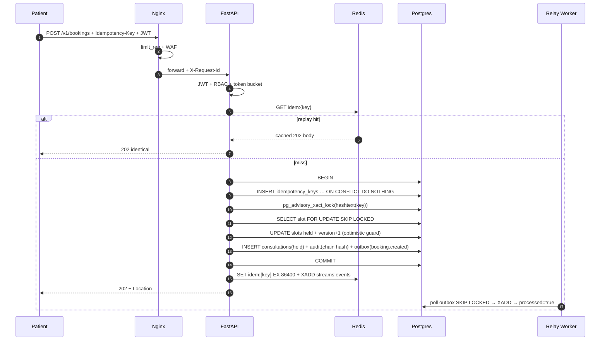

Booking a consultation slot is one of the most race-prone operations in a telemedicine platform: a popular doctor's 9 AM slot can see dozens of patients submit near-simultaneous requests, and mobile clients routinely retry on network timeout without knowing whether the original request landed. The Amrutam booking service solves both problems in a single code path — idempotency for retries, and PostgreSQL-level locking for concurrency — so that exactly one consultation row is ever created per slot.

## Why Idempotency Matters Here

A client that receives no response (timeout, dropped connection) has no way to know whether the server committed the booking. Re-submitting the same request without an idempotency key would create a duplicate consultation or, worse, a second slot lock attempt. By requiring a client-generated `Idempotency-Key` header, the server can replay the **identical 202 response** for any retry, making the operation safe to call any number of times.

<Warning>
  Always send the **exact same `Idempotency-Key` value** when retrying a failed or timed-out booking request. Generating a new key on each retry treats every attempt as a fresh booking and will exhaust your rate limit (30 bookings/minute per user).
</Warning>

## The Idempotency-Key Header

The `Idempotency-Key` header is **required** on `POST /v1/bookings`. Any request that omits it receives a `400 Bad Request` immediately — before any database work is attempted.

```bash
# The key should be a UUID or other high-entropy client-generated string
Idempotency-Key: 550e8400-e29b-41d4-a716-446655440000
```

The key is stored in the `idempotency_keys` Postgres table and cached in Redis under `idem:{key}` with a 24-hour TTL (`TTL_SECONDS = 86400`). Redis is a **cache only** — the Postgres row is the durable source of truth and survives a Redis restart.

## Booking Flow Step by Step

The full sequence — as documented in the architecture diagram — is reproduced below:



<Steps>
  <Step title="Redis replay check">
    The service calls `idem.get_replay(redis, key)` which does a plain `GET idem:{key}`. If a cached response body exists the handler returns it immediately and increments the `idempotency_replays_total` Prometheus counter. No Postgres connection is consumed.
  </Step>
  <Step title="Postgres durable fallback">
    If Redis misses (cold start, eviction, Redis outage), the service queries the `idempotency_keys` table directly. A completed row is re-cached in Redis and returned. This two-layer check means bookings survive a full Redis restart without creating duplicates.
  </Step>
  <Step title="Acquire advisory lock">
    Inside `BEGIN`, the service inserts `(key, 'pending')` into `idempotency_keys` with `ON CONFLICT DO NOTHING`. If another concurrent request already inserted this key, the insert returns no row and the request races to read the completed row; if it's still pending, it raises `409 conflict`. For the winner, `pg_try_advisory_xact_lock(hashtext(key))` is acquired — this lock is automatically released when the transaction ends.
  </Step>
  <Step title="Lock and inspect the slot">
    `SELECT … FROM availability_slots WHERE id = :s FOR UPDATE SKIP LOCKED` locks the target row exclusively. `SKIP LOCKED` means a concurrent transaction that already holds the lock causes this query to return zero rows, which the service maps to a `409 slot_taken` — no waiting, no deadlocks.
  </Step>
  <Step title="Optimistic version guard">
    ```sql
    UPDATE availability_slots
       SET status = 'held', version = version + 1
     WHERE id = :s AND version = :v AND status = 'open'
    ```
    Even after `FOR UPDATE`, a version check guards against a race where the slot transitioned between the `SELECT` and `UPDATE`. If `rowcount != 1` the booking is rejected as `409 slot_taken`.
  </Step>
  <Step title="Atomically create the consultation">
    In the same transaction: `INSERT INTO consultations (patient_id, doctor_id, slot_id, status) VALUES (…, 'held')`, followed by an audit log entry and a `booking.created` outbox event. All three writes commit together — there is no partial state.
  </Step>
  <Step title="Mark idempotent and publish">
    In a second (separate) transaction the `idempotency_keys` row is updated to `completed` with the response body. Then `idem.save_replay` caches the body in Redis (`SET idem:{key} EX 86400`), and a best-effort `XADD streams:events` publishes the event to the Redis stream. The relay worker picks up the durable outbox row independently.
  </Step>
  <Step title="Return 202 + Location">
    The response is `HTTP 202 Accepted` with a `Location: /v1/consultations/{id}` header. The consultation is in `held` status — payment must settle to move it to `confirmed`.
  </Step>
</Steps>

## Why 202 and Not 201?

The booking endpoint returns **202 Accepted** rather than 201 Created because the resource is not yet in its final state. The consultation record exists in `held` status but will only become `confirmed` after the payment saga settles asynchronously. The `Location` header tells the client where to poll for the final state.

## Rate Limiting

Booking requests are limited to **30 per minute per user** via a Redis fixed-window counter keyed as `booking:{user_id}`. The counter is incremented with `INCR` and a 60-second `EXPIRE` is set on the first hit. The limiter **fails open** on Redis outage — Nginx edge rate limits still apply.

```python
await check_rate_limit(redis, f"booking:{patient.id}", limit=30, window_s=60)
```

## Slot Expiry and Compensation

A held slot is locked for **15 minutes**. If payment does not complete within that window, a TTL compensation job resets the slot to `open`. This prevents slots from being permanently blocked by abandoned payment flows.

## Making a Booking Request

<Tabs>
  <Tab title="Request Schema">
    <ParamField body="slot_id" type="string" required>
      UUID of the availability slot to book. 8–64 characters.
    </ParamField>
    <ParamField header="Idempotency-Key" type="string" required>
      Client-generated unique key for this booking attempt. Use a UUID v4.
    </ParamField>
    <ParamField header="Authorization" type="string" required>
      `Bearer <access_token>`. Must be a `patient` role token.
    </ParamField>
  </Tab>
  <Tab title="cURL">
    ```bash
    curl -s -X POST https://api.example.com/v1/bookings \
      -H "Authorization: Bearer <access_token>" \
      -H "Content-Type: application/json" \
      -H "Idempotency-Key: 550e8400-e29b-41d4-a716-446655440000" \
      -d '{"slot_id": "018f4e2a-1234-7abc-89de-000000000099"}'
    ```
  </Tab>
  <Tab title="Response (202)">
    ```json
    {
      "id": "018f4e2a-1234-7abc-89de-000000000042",
      "status": "held",
      "slot_id": "018f4e2a-1234-7abc-89de-000000000099"
    }
    ```

    The `Location` response header contains the consultation URL:
    ```
    Location: /v1/consultations/018f4e2a-1234-7abc-89de-000000000042
    ```
  </Tab>
</Tabs>

## Error Reference

| Status | Code | Meaning |
|---|---|---|
| `400` | — | `Idempotency-Key` header missing |
| `404` | — | Slot ID does not exist |
| `409` | `slot_taken` | Slot already held, booked, or locked by a concurrent transaction |
| `409` | `conflict` | Two concurrent requests share the same idempotency key |
| `429` | — | Rate limit exceeded (30 bookings/min) |
