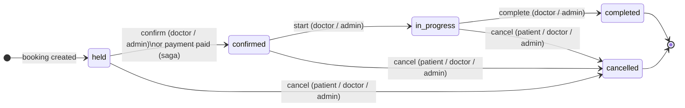

Every booked appointment is represented as a consultation record that progresses through a well-defined state machine. Rather than exposing separate endpoints for each status change, the API exposes a single transition endpoint that accepts a named action. The server validates that the action is legal from the current state, that the caller has the right role, and that ownership rules are satisfied — all before writing anything to the database.

## State Machine



Terminal states (`completed`, `cancelled`) accept no further transitions. Attempting an illegal action returns `400 Bad Request` with the message `illegal transition {current} + {action}`.

## Transition Table

The state machine is encoded directly in the service layer:

```python
_NEXT: dict[str, dict[str, str]] = {
    "held":        {"confirm": "confirmed",   "cancel": "cancelled"},
    "confirmed":   {"start": "in_progress",   "cancel": "cancelled"},
    "in_progress": {"complete": "completed",  "cancel": "cancelled"},
    "completed":   {},
    "cancelled":   {},
}
```

| Current Status | Action | Next Status | Allowed Roles |
|---|---|---|---|
| `held` | `confirm` | `confirmed` | `doctor`, `admin` |
| `held` | `cancel` | `cancelled` | `patient`, `doctor`, `admin` |
| `confirmed` | `start` | `in_progress` | `doctor`, `admin` |
| `confirmed` | `cancel` | `cancelled` | `patient`, `doctor`, `admin` |
| `in_progress` | `complete` | `completed` | `doctor`, `admin` |
| `in_progress` | `cancel` | `cancelled` | `patient`, `doctor`, `admin` |

<Info>
  The `confirm` action is also triggered automatically by the payment saga when `status: paid` arrives via webhook — this is the normal production path. Manual `confirm` is available to doctors and admins for cases where payment is handled out-of-band.
</Info>

## Triggering a Transition

Send `POST /v1/consultations/{cid}/transition` with the action name in the request body.

<Tabs>
  <Tab title="Request Schema">
    <ParamField path="cid" type="string" required>
      Consultation UUID.
    </ParamField>
    <ParamField body="action" type="string" required>
      One of `"confirm"`, `"start"`, `"complete"`, or `"cancel"`.
    </ParamField>
  </Tab>
  <Tab title="cURL — Confirm">
    ```bash
    curl -s -X POST \
      https://api.example.com/v1/consultations/018f4e2a-1234-7abc-89de-000000000042/transition \
      -H "Authorization: Bearer <doctor_access_token>" \
      -H "Content-Type: application/json" \
      -d '{"action": "confirm"}'
    ```
  </Tab>
  <Tab title="cURL — Cancel">
    ```bash
    curl -s -X POST \
      https://api.example.com/v1/consultations/018f4e2a-1234-7abc-89de-000000000042/transition \
      -H "Authorization: Bearer <patient_access_token>" \
      -H "Content-Type: application/json" \
      -d '{"action": "cancel"}'
    ```
  </Tab>
  <Tab title="Response">
    ```json
    {
      "id": "018f4e2a-1234-7abc-89de-000000000042",
      "patient_id": "018f4e2a-1234-7abc-89de-000000000001",
      "doctor_id": "018f4e2a-1234-7abc-89de-000000000002",
      "slot_id": "018f4e2a-1234-7abc-89de-000000000099",
      "status": "confirmed",
      "created_at": "2024-06-15T09:00:00Z"
    }
    ```
  </Tab>
</Tabs>

## Cancellation Compensation

When a consultation moves to `cancelled`, the service automatically releases the associated slot back to `open`:

```sql
UPDATE availability_slots
   SET status = 'open'
 WHERE id = :slot_id AND status IN ('held', 'booked')
```

This is idempotent — running it on an already-open slot is a no-op. A `consultation.cancelled` outbox event is also inserted so downstream workers can trigger any necessary notifications or refund flows.

## Ownership Rules

Access to a consultation is controlled by the caller's role:

<CardGroup cols={3}>
  <Card title="patient" icon="user">
    Can only read and act on consultations where `patient_id = user.id`. Any mismatch raises `403 Forbidden`.
  </Card>
  <Card title="doctor" icon="stethoscope">
    Can only read and act on consultations where `doctor_id = user.id`. Any mismatch raises `403 Forbidden`.
  </Card>
  <Card title="admin" icon="shield">
    No ownership restriction. Admins can read and transition any consultation.
  </Card>
</CardGroup>

The `_authorize` helper in the service checks these rules on both the list and detail endpoints — there is no separate admin-only route.

## Listing Consultations

`GET /v1/consultations` returns consultations visible to the authenticated user, ordered by `created_at DESC`. Patients see their own, doctors see their assigned, admins see all.

<Tabs>
  <Tab title="Parameters">
    <ParamField query="limit" type="integer" default="20">
      Maximum results per page. Hard cap of **100**.
    </ParamField>
    <ParamField query="cursor" type="string">
      Opaque keyset cursor. Pass the `created_at` value of the last item from the previous page to fetch the next page.
    </ParamField>
  </Tab>
  <Tab title="cURL — First Page">
    ```bash
    curl -s "https://api.example.com/v1/consultations?limit=20" \
      -H "Authorization: Bearer <access_token>"
    ```
  </Tab>
  <Tab title="cURL — Next Page">
    ```bash
    # Use the created_at of the last item as the cursor
    curl -s "https://api.example.com/v1/consultations?limit=20&cursor=2024-06-14T08:00:00Z" \
      -H "Authorization: Bearer <access_token>"
    ```
  </Tab>
  <Tab title="Response">
    ```json
    [
      {
        "id": "018f4e2a-1234-7abc-89de-000000000042",
        "patient_id": "018f4e2a-1234-7abc-89de-000000000001",
        "doctor_id": "018f4e2a-1234-7abc-89de-000000000002",
        "slot_id": "018f4e2a-1234-7abc-89de-000000000099",
        "status": "confirmed",
        "created_at": "2024-06-15T09:00:00Z"
      }
    ]
    ```
  </Tab>
</Tabs>

<Tip>
  Use keyset pagination rather than `OFFSET` for large result sets. On a table with `consultations` partitioned monthly, `OFFSET`-based pagination degrades to a full scan of all preceding rows. Keyset pagination via `created_at < :cursor` uses the `(created_at, id)` index and stays fast regardless of page depth.
</Tip>

## Fetching a Single Consultation

```bash
curl -s https://api.example.com/v1/consultations/018f4e2a-1234-7abc-89de-000000000042 \
  -H "Authorization: Bearer <access_token>"
```

Returns `404` if the consultation does not exist, and `403` if the caller fails the ownership check.

## Response Schema

<ResponseField name="id" type="string">
  UUID of the consultation.
</ResponseField>
<ResponseField name="patient_id" type="string">
  UUID of the patient who booked.
</ResponseField>
<ResponseField name="doctor_id" type="string">
  UUID of the assigned doctor.
</ResponseField>
<ResponseField name="slot_id" type="string">
  UUID of the availability slot.
</ResponseField>
<ResponseField name="status" type="string">
  Current status: `held`, `confirmed`, `in_progress`, `completed`, or `cancelled`.
</ResponseField>
<ResponseField name="created_at" type="string">
  ISO 8601 timestamp of when the consultation was created.
</ResponseField>

## Error Reference

| Status | Meaning |
|---|---|
| `400` | Illegal transition for the current status |
| `403` | Caller does not own the consultation, or role cannot perform the action |
| `404` | Consultation ID not found |
