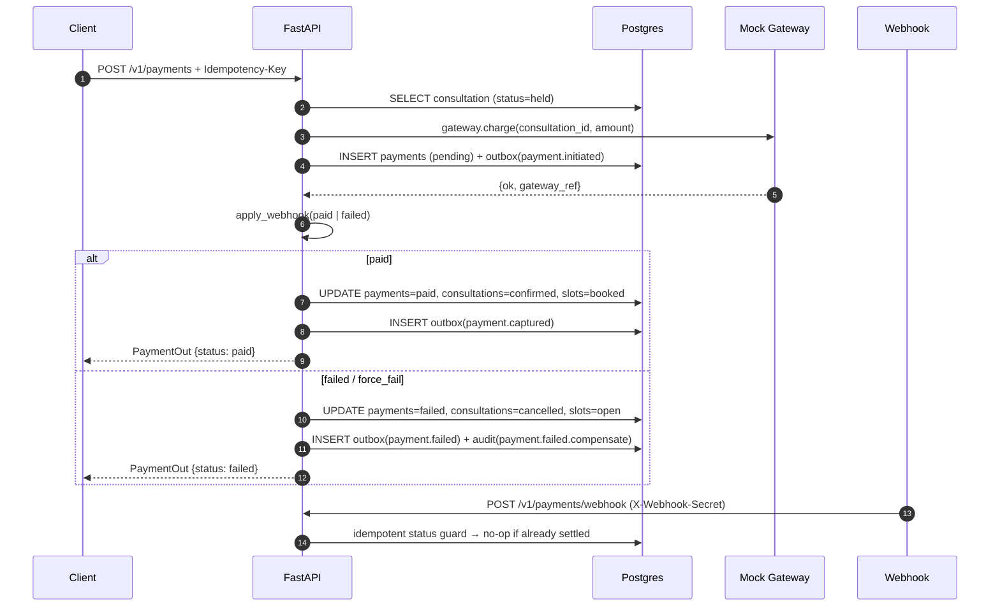

Charging a patient and confirming a consultation are two separate systems that must stay consistent even when the payment gateway times out, the webhook arrives twice, or the API pod crashes mid-flight. The Amrutam payment service implements a **saga pattern** with a transactional outbox: the booking creates a `held` consultation, the payment intent records a `pending` payment, and the webhook drives the final branch — either committing both sides (`paid` → `confirmed`) or rolling back both sides (`failed` → `cancelled` + slot `open`). Every step is idempotent, so at-least-once webhook delivery never double-charges or double-confirms.

<Warning>
  Set `PAYMENT_WEBHOOK_SECRET` to a high-entropy secret in production and share it only with your payment gateway provider. Any request to `POST /v1/payments/webhook` that does not include a matching `X-Webhook-Secret` header is rejected with `401 Unauthorized`. An empty or default secret is a critical security misconfiguration.
</Warning>

## Saga Overview



In the mock environment the gateway response is processed **synchronously** within the same request by calling `apply_webhook()` directly. In production a real gateway would call the webhook endpoint asynchronously; the code path is identical.

## Step 1 — Create a Payment Intent

`POST /v1/payments` — requires a `patient` or `admin` bearer token and an `Idempotency-Key` header. The request is rate-limited to **30 per minute per user**.

<Tabs>
  <Tab title="Request Schema">
    <ParamField body="consultation_id" type="string" required>
      UUID of the consultation to pay for. Must be in `held` status.
    </ParamField>
    <ParamField body="amount" type="integer" required>
      Amount in the smallest currency unit (e.g. paise for INR). 1–1,000,000.
    </ParamField>
    <ParamField body="currency" type="string" default="INR">
      ISO 4217 currency code. Up to 8 characters.
    </ParamField>
    <ParamField body="force_fail" type="boolean" default="false">
      Set to `true` in test environments to simulate a gateway failure and trigger the compensation branch.
    </ParamField>
    <ParamField header="Idempotency-Key" type="string" required>
      Client-generated unique key. Required for safe retries.
    </ParamField>
  </Tab>
  <Tab title="cURL — Success">
    ```bash
    curl -s -X POST https://api.example.com/v1/payments \
      -H "Authorization: Bearer <patient_access_token>" \
      -H "Content-Type: application/json" \
      -H "Idempotency-Key: pay-550e8400-e29b-41d4-a716-446655440001" \
      -d '{
        "consultation_id": "018f4e2a-1234-7abc-89de-000000000042",
        "amount": 50000,
        "currency": "INR"
      }'
    ```
  </Tab>
  <Tab title="cURL — Force Fail (testing)">
    ```bash
    curl -s -X POST https://api.example.com/v1/payments \
      -H "Authorization: Bearer <patient_access_token>" \
      -H "Content-Type: application/json" \
      -H "Idempotency-Key: pay-550e8400-e29b-41d4-a716-446655440002" \
      -d '{
        "consultation_id": "018f4e2a-1234-7abc-89de-000000000043",
        "amount": 50000,
        "currency": "INR",
        "force_fail": true
      }'
    ```
  </Tab>
  <Tab title="Response (202)">
    ```json
    {
      "id": "018f4e2a-1234-7abc-89de-000000000088",
      "consultation_id": "018f4e2a-1234-7abc-89de-000000000042",
      "status": "paid",
      "gateway_ref": "gw_mock_abc123"
    }
    ```
  </Tab>
</Tabs>

If a payment intent already exists for this `consultation_id` (from a previous request), the endpoint returns the stored row immediately without creating a duplicate — making it idempotent across retries.

## Step 2 — Webhook Settlement

`POST /v1/payments/webhook` is called by the payment gateway (or your test harness) to report the final charge outcome. It must include the `X-Webhook-Secret` header matching the `PAYMENT_WEBHOOK_SECRET` environment variable.

<Tabs>
  <Tab title="Webhook Request Schema">
    <ParamField body="consultation_id" type="string" required>
      UUID of the consultation this payment covers.
    </ParamField>
    <ParamField body="status" type="string" required>
      `"paid"` or `"failed"`. Any other value returns `400`.
    </ParamField>
    <ParamField body="gateway_ref" type="string" required>
      Gateway-assigned transaction reference. 1–128 characters.
    </ParamField>
    <ParamField header="X-Webhook-Secret" type="string" required>
      Must exactly match the `PAYMENT_WEBHOOK_SECRET` environment variable.
    </ParamField>
  </Tab>
  <Tab title="cURL — Simulate Paid">
    ```bash
    curl -s -X POST https://api.example.com/v1/payments/webhook \
      -H "Content-Type: application/json" \
      -H "X-Webhook-Secret: your-webhook-secret" \
      -d '{
        "consultation_id": "018f4e2a-1234-7abc-89de-000000000042",
        "status": "paid",
        "gateway_ref": "gw_live_xyz789"
      }'
    ```
  </Tab>
  <Tab title="cURL — Simulate Failed">
    ```bash
    curl -s -X POST https://api.example.com/v1/payments/webhook \
      -H "Content-Type: application/json" \
      -H "X-Webhook-Secret: your-webhook-secret" \
      -d '{
        "consultation_id": "018f4e2a-1234-7abc-89de-000000000043",
        "status": "failed",
        "gateway_ref": "gw_live_fail001"
      }'
    ```
  </Tab>
</Tabs>

### Settlement Branches

<Accordion title="status: paid — Happy Path">
  All three of these writes happen in a **single Postgres transaction**:

  1. `UPDATE payments SET status = 'paid', gateway_ref = :g WHERE id = :p`
  2. `UPDATE consultations SET status = 'confirmed' WHERE id = :c`
  3. `UPDATE availability_slots SET status = 'booked' WHERE id = :s AND status = 'held'`
  4. `INSERT INTO outbox_events … ('payment.captured')`

  The consultation moves to `confirmed` and the slot is permanently booked.
</Accordion>

<Accordion title="status: failed — Compensation">
  All compensation writes happen atomically:

  1. `UPDATE payments SET status = 'failed', gateway_ref = :g WHERE id = :p`
  2. `UPDATE consultations SET status = 'cancelled' WHERE id = :c`
  3. `UPDATE availability_slots SET status = 'open' WHERE id = :s AND status IN ('held', 'booked')`
  4. `INSERT INTO outbox_events … ('payment.failed')`
  5. Audit log entry: `actor=system, action=payment.failed.compensate`

  The slot is immediately returned to the pool for other patients to book.
</Accordion>

## Idempotent Webhook Delivery

Webhooks from real gateways are delivered with **at-least-once** guarantees — the same event may arrive more than once. The `apply_webhook()` handler guards against double-application:

```python
# Idempotent replay: same terminal state + same ref → return stored row
if pay[2] in ("paid", "failed") and pay[3] == gateway_ref:
    return {"id": pay[0], "consultation_id": pay[1], "status": pay[2], "gateway_ref": pay[3]}
if pay[2] in ("paid", "failed"):
    raise Conflict("payment already settled differently", code="payment_settled")
```

A duplicate webhook with the **same `gateway_ref`** and the same terminal status is a no-op that returns the stored row. A webhook that tries to change an already-settled payment to a different outcome raises `409 payment_settled`.

## Response Schema

<ResponseField name="id" type="string">
  UUID of the payment record.
</ResponseField>
<ResponseField name="consultation_id" type="string">
  UUID of the associated consultation.
</ResponseField>
<ResponseField name="status" type="string">
  Current payment status: `pending`, `paid`, or `failed`.
</ResponseField>
<ResponseField name="gateway_ref" type="string">
  Gateway transaction reference. `null` while status is `pending`.
</ResponseField>

## Environment Variables

| Variable | Description |
|---|---|
| `PAYMENT_WEBHOOK_SECRET` | Shared secret validated against the `X-Webhook-Secret` header on every webhook call |

## Error Reference

| Status | Code | Meaning |
|---|---|---|
| `400` | — | `Idempotency-Key` header missing, or `status` is not `paid`/`failed` |
| `400` | — | Consultation is not in `held` status (cannot initiate payment) |
| `401` | — | `X-Webhook-Secret` header missing or does not match `PAYMENT_WEBHOOK_SECRET` |
| `403` | — | Caller is not the patient who owns the consultation, or not an admin |
| `404` | — | Consultation not found |
| `409` | `payment_settled` | Webhook attempts to change an already-settled payment |
| `429` | — | Rate limit exceeded (30 payment intents/min per user) |
