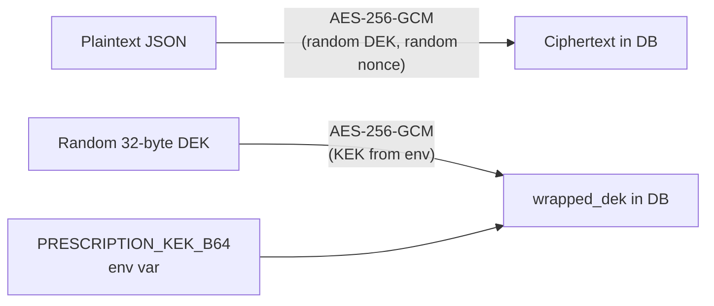

Prescriptions contain Protected Health Information (PHI) — diagnoses, medication names, and dosages — that must be stored at rest in a form that cannot be read even if the database is compromised. The Amrutam prescription service uses **AES-256-GCM envelope encryption**: each row gets its own randomly generated Data Encryption Key (DEK), which is itself encrypted by a Key Encryption Key (KEK) sourced from the environment (or a KMS in production). The encrypted ciphertext lives in Postgres; the rendered PDF lives in MinIO object storage, accessible only via short-lived presigned URLs.

## Encryption Model



The `seal()` function in `crypto.py`:

1. Generates a random 32-byte DEK and a random 12-byte nonce.
2. Encrypts the JSON plaintext with `AESGCM(dek).encrypt(nonce, plaintext, None)`.
3. Generates a random 12-byte KEK-nonce and encrypts the DEK with `AESGCM(kek).encrypt(kek_nonce, dek, None)`.
4. Stores `kek_nonce + sealed_dek` as `wrapped_dek`, `nonce` as `nonce`, and the ciphertext as `encrypted_payload` — all in the `prescriptions` table.

Decryption reverses the steps: unwrap the DEK with the KEK, then decrypt the ciphertext with the DEK.

```python
def seal(plaintext: bytes, kek_b64: str) -> tuple[bytes, bytes, bytes]:
    """Returns (wrapped_dek, nonce, ciphertext). wrapped_dek = kek_nonce(12) + sealed_dek."""
    dek = os.urandom(32)
    nonce = os.urandom(12)
    ct = AESGCM(dek).encrypt(nonce, plaintext, None)
    kek_nonce = os.urandom(12)
    sealed_dek = AESGCM(_kek(kek_b64)).encrypt(kek_nonce, dek, None)
    return kek_nonce + sealed_dek, nonce, ct
```

<Warning>
  Set `PRESCRIPTION_KEK_B64` to a Base64-encoded 32-byte key generated with a cryptographically secure random source. **Never use the dev default in production.** Rotating the KEK requires re-encrypting every `wrapped_dek` row — plan a key-rotation window before go-live. In production, replace the env-var KEK with a KMS-backed key reference.
</Warning>

## Access Control

Only three classes of user may create or read a prescription:

| Role | Can Create | Can Read |
|---|---|---|
| `doctor` (treating) | ✅ Only if `doctor_id` matches the consultation | ✅ |
| `patient` (in consultation) | ❌ | ✅ Only if `patient_id` matches the consultation |
| `admin` | ✅ | ✅ |

Any other caller receives `403 Forbidden`. The service also enforces that the consultation must be in a prescribable status (`confirmed`, `in_progress`, or `completed`) — you cannot issue a prescription for a `held` or `cancelled` consultation.

## Creating a Prescription

`POST /v1/consultations/{cid}/prescriptions` — requires a `doctor` or `admin` token.

<Tabs>
  <Tab title="Request Schema">
    <ParamField path="cid" type="string" required>
      Consultation UUID. The consultation must be in `confirmed`, `in_progress`, or `completed` status.
    </ParamField>
    <ParamField body="diagnosis" type="string" required>
      Free-text diagnosis. 1–2000 characters.
    </ParamField>
    <ParamField body="medicines" type="array" required>
      List of medicine strings (name, dosage, duration as free text). 1–50 items.
    </ParamField>
  </Tab>
  <Tab title="cURL">
    ```bash
    curl -s -X POST \
      https://api.example.com/v1/consultations/018f4e2a-1234-7abc-89de-000000000042/prescriptions \
      -H "Authorization: Bearer <doctor_access_token>" \
      -H "Content-Type: application/json" \
      -d '{
        "diagnosis": "Acute pharyngitis",
        "medicines": [
          "Amoxicillin 500mg — 1 tab TDS for 5 days",
          "Paracetamol 500mg — 1 tab SOS (max 3/day)"
        ]
      }'
    ```
  </Tab>
  <Tab title="Response (201)">
    ```json
    {
      "id": "018f4e2a-1234-7abc-89de-000000000077",
      "consultation_id": "018f4e2a-1234-7abc-89de-000000000042"
    }
    ```
  </Tab>
</Tabs>

### What Happens Internally

<Steps>
  <Step title="Authorise">
    Service verifies the caller is the treating doctor or an admin, and that the consultation is in a prescribable status.
  </Step>
  <Step title="Encrypt">
    The JSON payload `{diagnosis, medicines, consultation_id, doctor_id, issued_at}` is serialised and passed to `crypto.seal()`. The resulting `(wrapped_dek, nonce, ciphertext)` triple is inserted into `prescriptions`.
  </Step>
  <Step title="Render and upload PDF">
    `render_rx_pdf()` generates a PDF of the prescription. The PDF is uploaded to MinIO at key `rx/{rx_id}.pdf` via `store.put()`. In development the `MemoryPdfStore` is used as a fallback when MinIO is unavailable.
  </Step>
  <Step title="Audit and outbox">
    A `prescription.issued` audit log entry and a `prescription.issued` outbox event are inserted in the same transaction, ensuring the event is published exactly once even under crash recovery.
  </Step>
</Steps>

## Viewing Prescription Metadata

`GET /v1/prescriptions/{rx_id}` returns the decrypted diagnosis and medicines for authorized callers. The server decrypts on-the-fly — the plaintext is never stored.

```bash
curl -s https://api.example.com/v1/prescriptions/018f4e2a-1234-7abc-89de-000000000077 \
  -H "Authorization: Bearer <access_token>"
```

```json
{
  "id": "018f4e2a-1234-7abc-89de-000000000077",
  "consultation_id": "018f4e2a-1234-7abc-89de-000000000042",
  "diagnosis": "Acute pharyngitis",
  "medicines": [
    "Amoxicillin 500mg — 1 tab TDS for 5 days",
    "Paracetamol 500mg — 1 tab SOS (max 3/day)"
  ]
}
```

## Downloading the PDF

`GET /v1/prescriptions/{rx_id}/pdf` returns a **5-minute presigned MinIO URL** pointing to `rx/{rx_id}.pdf`. The URL is generated server-side — the client never needs MinIO credentials.

```bash
curl -s https://api.example.com/v1/prescriptions/018f4e2a-1234-7abc-89de-000000000077/pdf \
  -H "Authorization: Bearer <access_token>"
```

```json
{
  "url": "https://minio.example.com/rx-bucket/rx/018f4e2a-1234-7abc-89de-000000000077.pdf?X-Amz-Expires=300&X-Amz-Signature=...",
  "expires_in_s": 300
}
```

<Note>
  The presigned URL expires in **300 seconds** (5 minutes). Cache it locally if the user needs to re-download within the same session, rather than calling the PDF endpoint on every click.
</Note>

## MinIO / S3 Configuration

Set the following environment variables to connect to your MinIO or S3-compatible object store:

| Variable | Description |
|---|---|
| `S3_ENDPOINT` | MinIO endpoint URL, e.g. `http://minio:9000` |
| `S3_ACCESS_KEY` | MinIO access key |
| `S3_SECRET_KEY` | MinIO secret key |
| `S3_BUCKET` | Bucket name for prescription PDFs |

If any of these are missing or the MinIO connection fails at startup, the service falls back to `MemoryPdfStore` — an in-process store suitable only for integration tests.

## Response Schemas

<Accordion title="PrescriptionOut (create response)">
  <ResponseField name="id" type="string">
    UUID of the newly created prescription.
  </ResponseField>
  <ResponseField name="consultation_id" type="string">
    UUID of the associated consultation.
  </ResponseField>
</Accordion>

<Accordion title="PrescriptionView (read response)">
  <ResponseField name="id" type="string">
    UUID of the prescription.
  </ResponseField>
  <ResponseField name="consultation_id" type="string">
    UUID of the associated consultation.
  </ResponseField>
  <ResponseField name="diagnosis" type="string">
    Decrypted diagnosis text.
  </ResponseField>
  <ResponseField name="medicines" type="array">
    Decrypted list of medicine strings.
  </ResponseField>
</Accordion>

<Accordion title="PdfUrl (signed URL response)">
  <ResponseField name="url" type="string">
    Presigned MinIO/S3 URL valid for `expires_in_s` seconds.
  </ResponseField>
  <ResponseField name="expires_in_s" type="integer">
    TTL of the presigned URL in seconds (default 300).
  </ResponseField>
</Accordion>

## Error Reference

| Status | Meaning |
|---|---|
| `400` | Consultation not in a prescribable status, or legacy row without envelope |
| `403` | Caller is not the treating doctor, the patient in this consultation, or an admin |
| `404` | Consultation or prescription ID not found |
